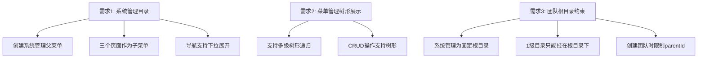

# 系统管理模块重构设计

将用户管理、团队管理、菜单管理归入"系统管理"目录，调整导航为下拉菜单，菜单管理改为树形展示，团队管理中"系统管理"团队固定为根目录。

## 现状分析


**当前问题**：
- 顶部导航平铺显示"用户管理"、"团队管理"、"菜单管理"三个菜单
- 菜单 seed 数据无 `parentId`，所有菜单都是一级
- 导航组件不支持下拉子菜单
- 团队管理侧边栏中"系统管理"团队与普通团队平级，无根目录约束

## 需求拆解



## Proposed Changes

### 数据层 - Seed 数据更新

#### [MODIFY] [seed.ts](file:///e:/idea/workspace/t3_stack_demo/packages/database/prisma/seed.ts)

将菜单从平铺改为层级结构：

```diff
 // 3. 初始化菜单
-const menus = [
-    { name: "用户管理", path: "/admin/users", icon: "users", sortOrder: 1 },
-    { name: "团队管理", path: "/admin/teams", icon: "building", sortOrder: 2 },
-    { name: "菜单管理", path: "/admin/menus", icon: "menu", sortOrder: 3 },
-];
+// 先创建父菜单"系统管理"
+const systemMenu = await db.menu.upsert({
+    where: { path: "/admin" },
+    update: {},
+    create: { name: "系统管理", path: "/admin", icon: "settings", sortOrder: 1 },
+});
+
+// 再创建子菜单
+const subMenus = [
+    { name: "用户管理", path: "/admin/users", icon: "users", sortOrder: 1, parentId: systemMenu.id },
+    { name: "团队管理", path: "/admin/teams", icon: "building", sortOrder: 2, parentId: systemMenu.id },
+    { name: "菜单管理", path: "/admin/menus", icon: "menu", sortOrder: 3, parentId: systemMenu.id },
+];
```

---

### 后端 - 菜单路由增强

#### [MODIFY] [menu.ts](file:///e:/idea/workspace/t3_stack_demo/apps/admin-service/src/routers/menu.ts)

增强 `getAll` 查询，支持递归多层级 children（当前只查两级）。确保菜单树在权限过滤时，**子菜单选中则自动包含其父菜单**。

---

### 前端 - 导航组件重构

#### [MODIFY] [navigation.tsx](file:///e:/idea/workspace/t3_stack_demo/apps/web/src/app/_components/navigation.tsx)

重构导航组件，支持**下拉子菜单**：

- 顶级菜单项：如果有 `children`，hover 时展示下拉面板
- "系统管理" 菜单 hover → 展开下拉列表显示"用户管理"、"团队管理"、"菜单管理"
- 无子菜单的项直接作为链接
- 当前路径在子菜单中时，父级菜单也高亮

```
┌──────────────────────────────────────────┐
│ 🔵  首页  系统管理▼                        │
│              ┌───────────┐               │
│              │ 用户管理    │               │
│              │ 团队管理    │               │
│              │ 菜单管理    │               │
│              └───────────┘               │
└──────────────────────────────────────────┘
```

---

### 前端 - 菜单管理页面

#### [MODIFY] [page.tsx](file:///e:/idea/workspace/t3_stack_demo/apps/web/src/app/admin/menus/page.tsx)

菜单管理页面已有 `renderTree` 递归渲染，当前逻辑基本满足。如后端支持了深层递归，前端无需大改。保持现有树形 checkbox 逻辑即可。

---

### 前端 - 团队管理约束

#### [MODIFY] [page.tsx](file:///e:/idea/workspace/t3_stack_demo/apps/web/src/app/admin/teams/page.tsx)

调整团队管理逻辑：

1. **"系统管理"固定为根目录**：始终在侧边栏顶部显示且不可删除/编辑
2. **1 级目录只能在根目录下**：创建团队时，如不指定 `parentId`，自动设为"系统管理"团队的 `id`（即 `admin-team`）
3. **侧边栏 "+" 创建按钮**：创建时默认 `parentId` 为 `admin-team`
4. **隐藏根团队的删除和编辑按钮**
5. **团队树展示**：以"系统管理"为根节点展开，所有 1 级团队都是其子节点

> [!IMPORTANT]
> 需要确认：创建子团队时，是否允许在任意团队下创建子团队？还是只允许在 1 级团队下创建？  
> **目前方案**：允许在任意团队下创建子团队（无限层级），但 1 级团队的 `parentId` 必须是 `admin-team`。

---

### 后端 - 团队路由约束

#### [MODIFY] [team.ts](file:///e:/idea/workspace/t3_stack_demo/apps/admin-service/src/routers/team.ts)

在 `team.create` 中增加校验：
- 若未指定 `parentId`，默认设为 `admin-team`
- 禁止删除 `admin-team`

## Verification Plan

### 浏览器验证

通过浏览器工具进行以下验证：

1. **导航下拉**：hover "系统管理" 菜单，验证下拉显示三个子菜单，点击任意子菜单跳转正确
2. **路径高亮**：进入 `/admin/users`，验证"系统管理"父菜单高亮
3. **菜单管理页**：进入菜单管理，验证树形结构正确展示（"系统管理" 下挂三个子菜单）
4. **团队管理页**：
   - "系统管理" 团队显示在侧边栏顶部
   - 点击 "+" 创建新团队，验证自动挂载到"系统管理"下
   - "系统管理"团队无删除/编辑按钮

### 手动验证（需用户配合）

1. 用户登录以 `admin@system.com` / `admin` 登录
2. 验证导航栏 hover 效果和下拉菜单交互体验
3. 创建新团队，确认层级关系正确
