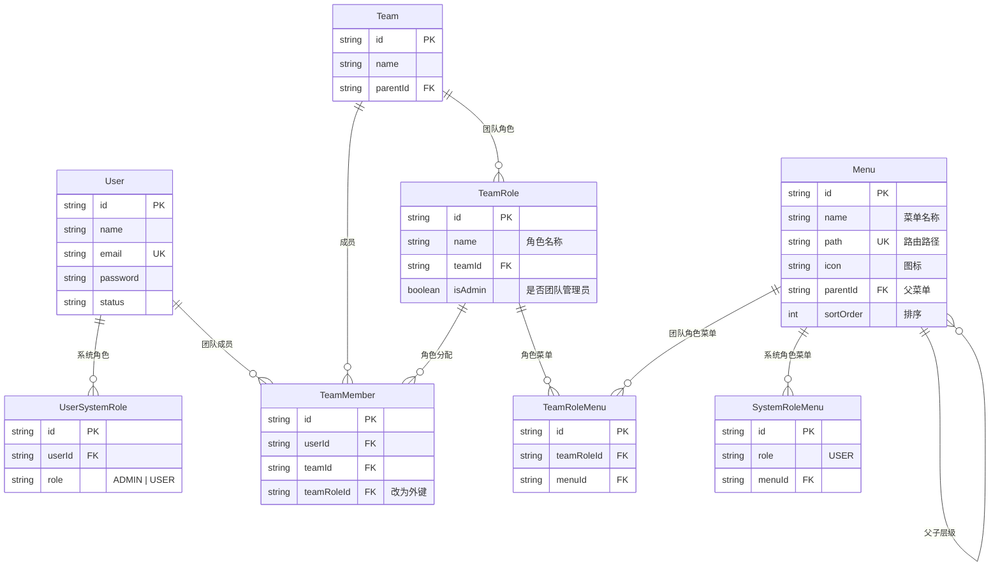
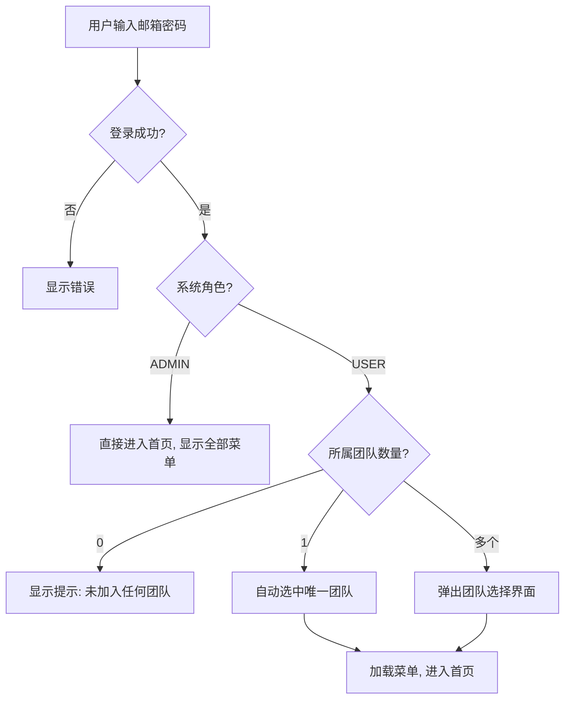
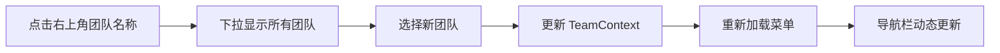

# 角色管理模块 — 设计文档

> 创建时间: 2026-02-11
> 模块: 角色管理（系统角色 + 团队角色 + 菜单权限）

---

## 1. 需求背景

系统需要同时支持**系统级角色**和**团队级角色**，并实现以下目标：

1. 团队之间的数据严格隔离
2. 团队管理员可自定义团队角色，并配置角色与菜单的关系
3. 系统管理员（ADMIN）通过 Seed/DB 分配，负责创建团队并指定团队管理员

---

## 2. 核心设计决策

| 决策项 | 结论 |
|--------|------|
| 系统角色 | 仅 `ADMIN` 和 `USER` |
| ADMIN 分配方式 | 仅通过 Seed / 直接修改数据库（无 UI） |
| 团队管理员指定 | 由 ADMIN 在创建团队时设置（模式 A） |
| 菜单定义方式 | 系统统一定义，通过 Seed 初始化（模式 A） |
| 团队角色 | 自定义，由团队管理员创建 |
| 菜单可见性公式 | `USER 角色菜单 ∪ 当前团队角色菜单` |
| ADMIN 权限 | 可查看所有团队数据，看到所有菜单 |
| 团队选择 | 登录后选择团队 + 右上角切换 |

---

## 3. 数据模型

### 3.1 整体关系图



### 3.2 新增表说明

| 表名 | 用途 |
|------|------|
| `Menu` | 系统统一定义的菜单/页面，Seed 初始化 |
| `SystemRoleMenu` | USER 角色能看到的菜单（ADMIN 默认全部看到，无需配置） |
| `TeamRole` | 团队自定义角色，由团队管理员创建 |
| `TeamRoleMenu` | 团队角色关联的菜单，团队管理员配置 |

### 3.3 表修改

| 表名 | 变更 |
|------|------|
| `TeamMember` | `role: String` → `teamRoleId: String`（外键关联 TeamRole） |
| `UserSystemRole` | `role` 取值从 `SUPER_ADMIN/ADMIN/USER` 改为 `ADMIN/USER` |

---

## 4. 权限模型

### 4.1 角色职责矩阵

```
ADMIN（系统管理员）
  ├── 管理所有用户
  ├── 创建/删除团队
  ├── 指定团队的 TEAM_ADMIN
  ├── 配置 USER 角色的菜单
  ├── 查看所有团队数据（无隔离）
  └── 菜单: 看到全部

USER（普通用户）
  ├── 查看 ADMIN 配置的菜单
  ├── 通过 TeamMember 加入团队
  └── 菜单: SystemRoleMenu(USER) ∪ TeamRoleMenu(当前团队角色)

TEAM_ADMIN（团队管理员，TeamRole.isAdmin=true）
  ├── 创建/编辑/删除本团队的 TeamRole
  ├── 配置 TeamRole 的菜单
  ├── 添加/移除本团队成员
  ├── 修改成员的 TeamRole
  └── 菜单: 同 USER 规则
```

### 4.2 菜单可见性计算

```
if (user.systemRole === "ADMIN") {
    visibleMenus = allMenus;  // 全部可见
} else {
    const userMenus = SystemRoleMenu.where(role="USER");
    const teamMenus = TeamRoleMenu.where(teamRoleId=currentTeamRole);
    visibleMenus = union(userMenus, teamMenus);
}
```

### 4.3 团队数据隔离规则

| 操作 | ADMIN | TEAM_ADMIN | 普通成员 |
|------|-------|------------|---------|
| 查看团队列表 | 全部 | 仅自己的团队 | 仅自己的团队 |
| 管理团队角色 | ✅ | ✅ 仅本团队 | ❌ |
| 管理团队成员 | ✅ | ✅ 仅本团队 | ❌ |
| 查看角色数据 | 全部 | 仅本团队 | 仅本团队 |

---

## 5. 用户流程

### 5.1 登录与团队选择



### 5.2 团队切换



---

## 6. 初始化数据（Seed）

```
ADMIN 账号:
  - email: admin@system.com
  - password: admin
  - systemRole: ADMIN

系统菜单:
  ├── 用户管理     /admin/users
  ├── 团队管理     /admin/teams
  ├── 菜单管理     /admin/menus
  └── (未来扩展...)

USER 默认菜单:
  └── (由 ADMIN 登录后在菜单管理页配置)
```
